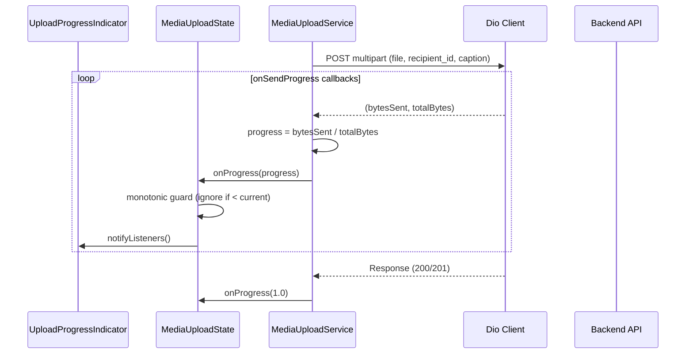

# Design Document: File Upload Progress

## Overview

This feature replaces the `http.MultipartRequest` upload in `MediaUploadService.uploadSingleFile` with Dio's `MultipartFile` + `onSendProgress`, enabling real-time byte-level progress reporting. The existing `MediaUploadState` and `UploadProgressIndicator` already handle intermediate progress values — they just need real data. The change is confined to the upload mechanism itself, with one small addition: a monotonic progress guard in `MediaUploadState` to handle out-of-order callbacks.

## Architecture



The data flow is unchanged from the current architecture. The only difference is that Dio fires `onSendProgress` many times during transmission instead of the current 0→1 jump.

## Components and Interfaces

### MediaUploadService Changes

The `uploadSingleFile` method signature remains identical. Internally:

**Remove:**
- `import 'package:http/http.dart' as http;`
- `http.MultipartRequest` construction
- `request.send()` + `http.Response.fromStream()`

**Add:**
- `import 'package:dio/dio.dart';`
- Create a `Dio` instance with `BaseOptions(connectTimeout: timeout, receiveTimeout: timeout)`
- Build `FormData` with `MapEntry` fields and `MultipartFile.fromBytes`
- Call `dio.post(url, data: formData, onSendProgress: ...)` 
- Map `onSendProgress(int sent, int total)` → `onProgress?.call(sent / total)`

**Preserved (unchanged):**
- Method signature and return type (`Future<UploadResult>`)
- Retry loop structure (while/try/catch)
- `_isRetryableStatusCode`, `_backoff`, `_parseMediaType` helpers
- `uploadBatch`, `_uploadParallel`, `_uploadSequential` methods
- `UploadProgress`, `UploadResult`, `UploadStatus`, `UploadStrategy` classes

### Dio Instance Configuration

```dart
final dio = Dio(BaseOptions(
  connectTimeout: timeout,
  receiveTimeout: timeout,
  // Don't follow redirects automatically for upload
  followRedirects: false,
  // Don't validate status — we handle it manually
  validateStatus: (status) => true,
));
```

Using `validateStatus: (_) => true` ensures Dio doesn't throw on 4xx/5xx, letting the existing status-code branching logic work unchanged.

### FormData Construction

```dart
final formData = FormData.fromMap({
  'recipient_id': recipientId.toString(),
  if (caption != null && caption.isNotEmpty) 'caption': caption,
  'file': MultipartFile.fromBytes(
    file.bytes,
    filename: file.fileName,
    contentType: DioMediaType.parse(file.mimeType),
  ),
});
```

### onSendProgress Mapping

```dart
onSendProgress: (int sent, int total) {
  if (total > 0) {
    onProgress?.call(sent / total);
  }
},
```

For zero-byte files (`total == 0`), the guard skips intermediate callbacks. The method reports 0.0 at start and 1.0 after the response, matching Requirement 5.4.

### MediaUploadState — Monotonic Progress Guard

Add a check in `updateProgress` to reject stale values:

```dart
void updateProgress(String fileId, UploadProgress progress) {
  final existing = _uploads[fileId];
  
  // Allow progress reset only on retry (status change to retrying/uploading from a different status)
  final isRetryReset = existing != null &&
      progress.fileProgress < existing.progress.fileProgress &&
      (progress.status == UploadStatus.retrying || 
       (progress.status == UploadStatus.uploading && 
        existing.progress.status == UploadStatus.retrying));
  
  // Ignore stale values (lower progress without a retry reset)
  if (existing != null &&
      progress.fileProgress < existing.progress.fileProgress &&
      !isRetryReset) {
    return;
  }
  
  _uploads[fileId] = _UploadEntry(progress: progress);
  notifyListeners();
}
```

### UploadProgressIndicator

No changes needed. It already renders `progress.fileProgress` as a `LinearProgressIndicator` value and displays the percentage. Once real intermediate values flow through, the UI animates smoothly.

## Data Models

No new data models. Existing classes are sufficient:

| Class | Role | Changes |
|-------|------|---------|
| `UploadProgress` | Per-file progress tracking | None |
| `UploadResult` | Upload outcome | None |
| `UploadStatus` | Enum (pending, uploading, success, failed, retrying) | None |
| `UploadStrategy` | Enum (parallel, sequential) | None |
| `MediaUploadState` | ChangeNotifier with per-file map | Monotonic guard added |
| `_UploadEntry` | Internal state wrapper | None |

## Correctness Properties

*A property is a characteristic or behavior that should hold true across all valid executions of a system — essentially, a formal statement about what the system should do. Properties serve as the bridge between human-readable specifications and machine-verifiable correctness guarantees.*

### Property 1: Progress ratio correctness

*For any* pair (bytesSent, totalBytes) where totalBytes > 0, the reported progress value SHALL equal bytesSent / totalBytes, clamped to the range [0.0, 1.0].

**Validates: Requirements 1.1**

### Property 2: Request construction completeness

*For any* valid combination of (token, recipientId, caption, file), the constructed Dio FormData SHALL contain the Authorization header with the token, the recipient_id field matching the input, the file attachment with correct filename and MIME type, and the caption field if and only if caption is non-null and non-empty.

**Validates: Requirements 2.3**

### Property 3: Retry behavior determined by status code

*For any* HTTP status code in 400-599, the upload service SHALL retry exactly up to 3 times if the code is in 500-599 (retryable), and SHALL retry exactly 0 times if the code is in 400-499 (non-retryable).

**Validates: Requirements 3.1, 3.2**

### Property 4: Batch strategy selection

*For any* positive integer batch size, getStrategy SHALL return parallel if batchSize ≤ 5 and sequential if batchSize > 5.

**Validates: Requirements 3.4**

### Property 5: Overall progress is average of file progress values

*For any* set of N file uploads with progress values p₁...pₙ, the overallProgress SHALL equal (p₁ + p₂ + ... + pₙ) / N.

**Validates: Requirements 4.3**

### Property 6: Monotonic progress invariant

*For any* sequence of progress updates for a single file (excluding retry resets), the stored progress value SHALL be non-decreasing. That is, if update(fileId, p₂) arrives after update(fileId, p₁) and p₂ < p₁ without a status change indicating retry, the stored value SHALL remain p₁.

**Validates: Requirements 4.4**

## Error Handling

| Scenario | Behavior |
|----------|----------|
| No auth token | Return `UploadResult(success: false)` immediately, no network call |
| Server 5xx | Retry up to 3× with exponential backoff (1s, 2s, 4s) |
| Client 4xx | Return failure immediately, parse error body if available |
| Timeout | Retry up to 3× (same as 5xx) |
| Network error | Retry up to 3× (same as 5xx) |
| DioException (cancel) | Return failure, no retry |
| Zero-byte file | Report 0.0 → 1.0 (Dio won't fire onSendProgress for empty body) |
| All retries exhausted | Return `UploadResult(success: false, errorMessage: descriptive)` |

Dio throws `DioException` with typed `DioExceptionType` values. The catch block maps these:
- `DioExceptionType.connectionTimeout` / `DioExceptionType.receiveTimeout` → retryable
- `DioExceptionType.connectionError` → retryable  
- `DioExceptionType.cancel` → non-retryable
- `DioExceptionType.badResponse` → handled by status code check (won't occur with `validateStatus: (_) => true`)

## Testing Strategy

### Unit Tests (example-based)
- Verify final progress is 1.0 on success (Req 1.3)
- Verify progress resets to 0.0 on retry (Req 1.4, 3.3)
- Verify no-token returns immediate failure (Req 5.2)
- Verify zero-byte file reports 0.0 then 1.0 (Req 5.4)
- Widget test: UploadProgressIndicator renders correct percentage (Req 4.2)

### Property Tests (universal properties)
- **Library**: `dart_quickcheck` or `test` package with custom generators (Dart doesn't have a dominant PBT library; use `test` with randomized loops of 100+ iterations)
- **Configuration**: Minimum 100 iterations per property
- **Tag format**: `Feature: file-upload-progress, Property N: [title]`

Properties to implement:
1. Progress ratio correctness (pure math)
2. Request construction completeness (FormData inspection)
3. Retry behavior by status code (mock Dio adapter)
4. Batch strategy selection (pure function)
5. Overall progress averaging (state computation)
6. Monotonic progress invariant (state sequence)

### Integration Tests
- Upload a real file to a mock server, verify onSendProgress fires with intermediate values (Req 1.2)
- Full batch upload with mixed success/failure, verify state tracking (Req 4.1)
