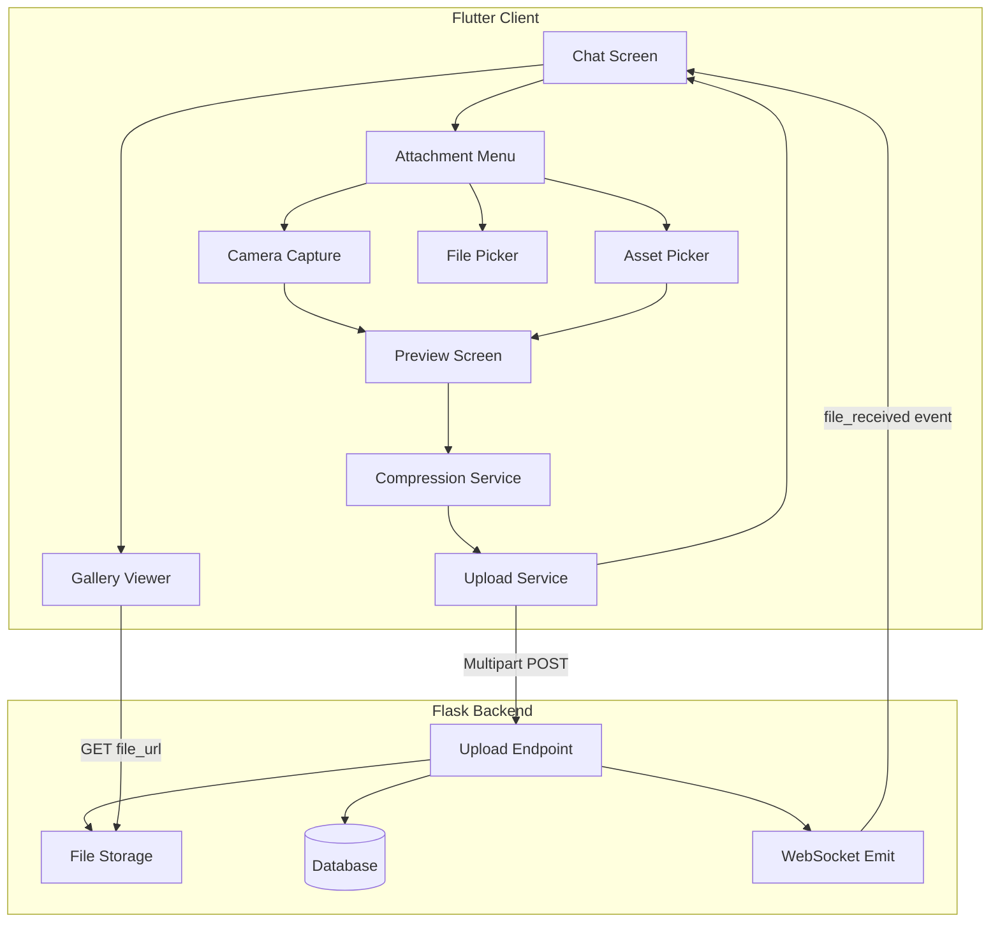
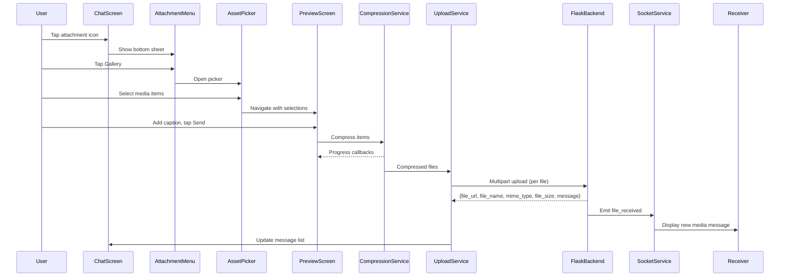

# Design Document: Multi-Image Picker Gallery

## Overview

This design describes the architecture for a WhatsApp-style media sharing experience in the Flutter messenger app. The feature spans the full lifecycle of media sharing: selection via a custom gallery picker, preview with reorder/caption, compression, upload to the Flask backend, real-time delivery via WebSocket, and a full-screen gallery viewer for browsing conversation media.

The system integrates with the existing `SocketService`, `MessageService`, and `Message` model, extending them to support batch media operations while maintaining backward compatibility with the current single-file upload flow.

### Key Design Decisions

- **`wechat_assets_picker`** for the gallery picker — provides WhatsApp-style multi-select with numbered badges, album browsing, and video duration overlays out of the box
- **`flutter_image_compress`** for image compression — native performance, supports JPEG/PNG/HEIC/WebP, configurable quality
- **`video_compress`** for video compression — re-encodes to target resolution/bitrate
- **Existing multipart upload endpoint** extended to return structured metadata
- **`photo_view`** for the gallery viewer — pinch-to-zoom, double-tap zoom, smooth transitions
- **State management via `ChangeNotifier`** — consistent with the app's existing pattern (no Bloc/Riverpod introduction)

## Architecture



### Component Interaction Sequence



## Components and Interfaces

### 1. Attachment Menu (`AttachmentMenuSheet`)

**Location:** `lib/widgets/attachment_menu_sheet.dart`

A modal bottom sheet presenting Camera, Gallery, and Document options with dark theme styling.

```dart
class AttachmentMenuSheet extends StatelessWidget {
  final VoidCallback onCameraTap;
  final VoidCallback onGalleryTap;
  final VoidCallback onDocumentTap;

  const AttachmentMenuSheet({
    required this.onCameraTap,
    required this.onGalleryTap,
    required this.onDocumentTap,
  });
}
```

**Behavior:**
- Slides up with 300ms animation
- Three options in fixed order: Camera (icon: `Icons.camera_alt`), Gallery (icon: `Icons.photo_library`), Document (icon: `Icons.insert_drive_file`)
- Dark background (`Color(0xFF1E1E1E)`), white text
- Dismisses on outside tap or swipe down

### 2. Asset Picker Integration (`MediaPickerService`)

**Location:** `lib/services/media_picker_service.dart`

Wraps `wechat_assets_picker` configuration and permission handling.

```dart
class MediaPickerService {
  /// Opens the asset picker with WhatsApp-style configuration.
  /// Returns null if cancelled or permission denied.
  static Future<List<AssetEntity>?> pickAssets(
    BuildContext context, {
    List<AssetEntity>? selectedAssets,
    int maxAssets = 20,
  });

  /// Opens device camera for photo/video capture.
  /// Returns null if cancelled or permission denied.
  static Future<AssetEntity?> captureFromCamera(
    BuildContext context, {
    Duration maxVideoDuration = const Duration(seconds: 60),
  });

  /// Checks and requests photo library permission.
  /// Returns true if granted.
  static Future<bool> requestPhotoPermission();

  /// Checks and requests camera permission.
  /// Returns true if granted.
  static Future<bool> requestCameraPermission();
}
```

**Picker Configuration:**
- `maxAssets: 20`
- `requestType: RequestType.common` (images + videos)
- `themeColor: Color(0xFF25D366)` (WhatsApp green accent)
- Dark theme delegate matching app theme
- Numbered selection badges (built-in)
- Album selector enabled

### 3. Preview Screen (`MediaPreviewScreen`)

**Location:** `lib/screens/media_preview_screen.dart`

Full-screen preview with thumbnail strip, reorder, remove, caption, and send.

```dart
class MediaPreviewScreen extends StatefulWidget {
  final List<AssetEntity> selectedAssets;
  final int recipientId;
  final bool fromCamera; // Shows "Add More" button when true

  const MediaPreviewScreen({
    required this.selectedAssets,
    required this.recipientId,
    this.fromCamera = false,
  });
}
```

**State:**
- `List<AssetEntity> _items` — mutable ordered list
- `int _currentIndex` — currently previewed item
- `String _caption` — caption text (max 1024 chars)
- `bool _isSending` — prevents duplicate submissions
- `CompressionProgress? _compressionProgress` — tracks compression state

**Key behaviors:**
- Horizontal `ReorderableListView` for thumbnail strip
- Remove button (X) on each thumbnail
- Main area shows full preview of selected thumbnail
- Video items show play button overlay + duration label
- Send button triggers compression → upload pipeline
- Back button returns to picker with selection preserved

### 4. Compression Service (`CompressionService`)

**Location:** `lib/services/compression_service.dart`

Handles image and video compression with progress reporting and error fallback.

```dart
class CompressionResult {
  final Uint8List bytes;
  final String mimeType;
  final String fileName;
  final int originalSize;
  final int compressedSize;
  final bool compressionSkipped;

  const CompressionResult({...});
}

typedef CompressionProgressCallback = void Function(int completed, int total);

class CompressionService {
  /// Compresses a batch of media items.
  /// Calls [onProgress] after each item completes.
  /// Returns results in the same order as input.
  static Future<List<CompressionResult>> compressBatch(
    List<AssetEntity> assets, {
    CompressionProgressCallback? onProgress,
    int imageQuality = 70,
    int maxImageDimension = 1920,
    Duration itemTimeout = const Duration(seconds: 30),
  });

  /// Compresses a single image.
  /// Returns original bytes if compression fails or format is GIF.
  static Future<CompressionResult> compressImage(
    AssetEntity asset, {
    int quality = 70,
    int maxDimension = 1920,
  });

  /// Compresses a single video.
  /// Target: max 720p, max 2Mbps bitrate, ≤50% of original size.
  static Future<CompressionResult> compressVideo(
    AssetEntity asset,
  );

  /// Calculates target dimensions preserving aspect ratio.
  /// If longest side > maxDimension, scales down proportionally.
  static Size calculateTargetDimensions(
    int width,
    int height, {
    int maxDimension = 1920,
  });
}
```

**Rules:**
- Images: JPEG output at 65-75% quality, max 1920px longest side
- GIFs: passthrough (no recompression)
- Videos: 720p max, 2Mbps bitrate, target ≤50% original size
- 30-second timeout per item — fallback to original on timeout
- On any compression error — return original with `compressionSkipped: true`

### 5. Upload Service (`MediaUploadService`)

**Location:** `lib/services/media_upload_service.dart`

Manages batch upload with progress tracking, retry logic, and strategy selection.

```dart
enum UploadStrategy { parallel, sequential }

class UploadProgress {
  final int fileIndex;
  final int totalFiles;
  final double fileProgress; // 0.0 to 1.0
  final UploadStatus status;

  const UploadProgress({...});
}

enum UploadStatus { pending, uploading, success, failed, retrying }

class MediaUploadService {
  /// Uploads a batch of compressed files.
  /// Uses parallel upload for ≤5 files, sequential for >5.
  /// Attaches caption to first message only.
  static Future<List<UploadResult>> uploadBatch({
    required List<CompressionResult> files,
    required int recipientId,
    String? caption,
    void Function(UploadProgress)? onProgress,
    int maxRetries = 3,
    Duration timeout = const Duration(seconds: 120),
  });

  /// Determines upload strategy based on batch size.
  static UploadStrategy getStrategy(int batchSize) =>
      batchSize <= 5 ? UploadStrategy.parallel : UploadStrategy.sequential;

  /// Uploads a single file with retry logic.
  static Future<UploadResult> uploadSingleFile({
    required CompressionResult file,
    required int recipientId,
    String? caption,
    void Function(double progress)? onProgress,
    int maxRetries = 3,
    Duration timeout = const Duration(seconds: 120),
  });
}

class UploadResult {
  final bool success;
  final Message? message;
  final String? errorMessage;
  final int retryCount;

  const UploadResult({...});
}
```

**Upload flow:**
1. Determine strategy (parallel vs sequential)
2. For each file: multipart POST to `/api/mobile/messages/upload`
3. On success: parse response into `Message` object
4. On failure: retry up to 3 times with exponential backoff
5. Report progress via callback
6. Caption attached only to first file's upload request

### 6. Gallery Viewer (`MediaGalleryViewer`)

**Location:** `lib/screens/media_gallery_viewer.dart`

Full-screen viewer with swipe navigation, zoom, video playback, and metadata overlay.

```dart
class MediaGalleryViewer extends StatefulWidget {
  final List<Message> mediaMessages; // All media messages in conversation
  final int initialIndex; // Which item to show first
  final int currentUserId;

  const MediaGalleryViewer({
    required this.mediaMessages,
    required this.initialIndex,
    required this.currentUserId,
  });
}
```

**Features:**
- `PageView` for horizontal swipe navigation
- `PhotoView` for pinch-to-zoom (1x–5x) and double-tap (toggle 1x/2x)
- Video playback with controls (play/pause, seek bar, mute)
- Metadata overlay: sender name, timestamp, position indicator ("N of M")
- Tap to toggle overlay visibility
- Preloads adjacent items (index ± 1)
- Close button + system back gesture to dismiss
- Share and download buttons in overlay
- Swipe disabled when zoomed beyond 1.0x

## Data Models

### MediaItem (Preview Screen state)

```dart
class MediaItem {
  final AssetEntity asset;
  final String id; // Unique identifier for reordering
  final MediaItemType type; // image or video
  final Duration? videoDuration;
  final int? width;
  final int? height;

  const MediaItem({...});
}

enum MediaItemType { image, video }
```

### CompressionResult (already defined above)

### UploadState (Chat Screen state for in-progress uploads)

```dart
class MediaUploadState extends ChangeNotifier {
  final Map<String, UploadProgress> _uploads = {};

  void updateProgress(String fileId, UploadProgress progress) {
    _uploads[fileId] = progress;
    notifyListeners();
  }

  void removeUpload(String fileId) {
    _uploads.remove(fileId);
    notifyListeners();
  }

  UploadProgress? getProgress(String fileId) => _uploads[fileId];
  List<UploadProgress> get activeUploads => _uploads.values.toList();
  bool get hasActiveUploads => _uploads.isNotEmpty;
}
```

### GalleryViewerState

```dart
class GalleryViewerState {
  final List<Message> mediaMessages;
  final int currentIndex;
  final bool overlayVisible;
  final double zoomLevel;
  final bool isVideoPlaying;

  const GalleryViewerState({...});
}
```

### Extended Message fields (already supported)

The existing `Message` model already has `fileUrl`, `fileName`, `fileSize`, `fileType`, and `messageType` fields. No model changes needed — the upload response maps directly to these fields.

## API Endpoints

### Upload Endpoint (existing, extended response)

**`POST /api/mobile/messages/upload`**

Request (multipart/form-data):
```
file: <binary file data>
recipient_id: int
caption: string (optional, max 1024 chars)
```

Response (200):
```json
{
  "success": true,
  "file_url": "/uploads/2025/01/abc123.jpg",
  "file_name": "photo_001.jpg",
  "file_type": "image/jpeg",
  "file_size": 245760,
  "message": {
    "id": 12345,
    "sender_id": 1,
    "recipient_id": 2,
    "content": "optional caption text",
    "message_type": "image",
    "timestamp": "2025-01-15T10:30:00Z",
    "timestamp_ms": 1736935800000,
    "is_read": false,
    "status": "sent",
    "thread_id": "1_2",
    "file_url": "/uploads/2025/01/abc123.jpg",
    "file_name": "photo_001.jpg",
    "file_type": "image/jpeg",
    "file_size": 245760,
    "reactions": {}
  }
}
```

### WebSocket Events

**`file_received`** (server → client, existing event):
```json
{
  "id": 12345,
  "sender_id": 1,
  "recipient_id": 2,
  "content": "caption text or empty",
  "message_type": "image",
  "timestamp": "2025-01-15T10:30:00Z",
  "timestamp_ms": 1736935800000,
  "file_url": "/uploads/2025/01/abc123.jpg",
  "file_name": "photo_001.jpg",
  "file_type": "image/jpeg",
  "file_size": 245760,
  "is_read": false,
  "status": "sent",
  "thread_id": "1_2",
  "reactions": {}
}
```

This event is already handled by the existing `_fileReceivedListeners` in `SocketService`. No new WebSocket events are needed — the backend emits `file_received` for each uploaded file, and the receiver's chat screen already processes these into the message list.

## State Management

The feature uses `ChangeNotifier` + `setState` consistent with the existing app patterns:

1. **Preview Screen** — local `StatefulWidget` state for item list, current index, caption, sending state
2. **Upload Progress** — `MediaUploadState` (ChangeNotifier) injected into chat screen for showing per-file progress indicators
3. **Gallery Viewer** — local `StatefulWidget` state for current page, overlay visibility, zoom level, video controller
4. **Compression Progress** — callback-based, displayed in Preview Screen's local state

No new global state management (Provider/Bloc) is introduced. The `MediaUploadState` is scoped to the chat screen's lifecycle.

## Dependencies

New packages to add to `pubspec.yaml`:

```yaml
# Multi-image picker (WhatsApp-style gallery)
wechat_assets_picker: ^9.0.0

# Image compression
flutter_image_compress: ^2.3.0

# Video compression
video_compress: ^3.1.3

# Full-screen image viewer with zoom
photo_view: ^0.15.0

# Video player for gallery viewer
video_player: ^2.9.0
# Video player controls UI
chewie: ^1.8.0
```

Existing packages already in use that this feature leverages:
- `http` — multipart upload
- `permission_handler` — camera/photo library permissions
- `image_picker` — camera capture fallback
- `share_plus` — share from gallery viewer
- `path_provider` — temp file storage during compression

## Correctness Properties

*A property is a characteristic or behavior that should hold true across all valid executions of a system — essentially, a formal statement about what the system should do. Properties serve as the bridge between human-readable specifications and machine-verifiable correctness guarantees.*

### Property 1: Reorder preserves all items

*For any* list of selected media items and any valid drag-and-drop reorder operation (moving item from index A to index B), the resulting list should contain exactly the same items as the original list, with only their positions changed.

**Validates: Requirements 3.3**

### Property 2: Remove item decreases list size

*For any* list of N selected media items (N > 1) and any valid index I, removing the item at index I should result in a list of N-1 items that does not contain the removed item and preserves the relative order of remaining items.

**Validates: Requirements 3.4**

### Property 3: Caption length constraint

*For any* input string, the caption field should accept at most 1024 characters. Any string of length > 1024 should be truncated to exactly 1024 characters.

**Validates: Requirements 3.6**

### Property 4: Video duration formatting

*For any* duration value in seconds (≥ 0), the formatter should produce a string in `mm:ss` format for durations less than 3600 seconds, and `h:mm:ss` format for durations of 3600 seconds or more, with minutes and seconds zero-padded to two digits.

**Validates: Requirements 3.9**

### Property 5: Image dimension scaling preserves aspect ratio

*For any* image with dimensions (width, height) where max(width, height) > maxDimension, the calculated target dimensions should have max(targetWidth, targetHeight) = maxDimension and the aspect ratio targetWidth/targetHeight should equal width/height (within floating-point tolerance).

**Validates: Requirements 4.2**

### Property 6: GIF passthrough preserves bytes

*For any* GIF file input, the compression service should return output bytes identical to the input bytes with `compressionSkipped: false` (passthrough is intentional, not a failure).

**Validates: Requirements 4.8**

### Property 7: Compression failure returns original with flag

*For any* media item where the compression operation throws an exception, the compression service should return the original uncompressed bytes with `compressionSkipped: true`.

**Validates: Requirements 4.5**

### Property 8: Upload response maps to complete message

*For any* successful upload response containing `file_url`, `file_name`, `file_type`, and `file_size` fields, the created `Message` object should contain all four fields with values matching the response.

**Validates: Requirements 5.2**

### Property 9: Caption attached only to first message in batch

*For any* batch of N files (N ≥ 1) with a non-empty caption, only the first upload request should include the caption parameter, and upload requests for files at indices 1 through N-1 should have no caption.

**Validates: Requirements 5.3**

### Property 10: Upload strategy determined by batch size

*For any* batch size N, if N ≤ 5 the upload strategy should be `parallel`, and if N > 5 the strategy should be `sequential`.

**Validates: Requirements 5.7**

### Property 11: Upload retry continues remaining files

*For any* batch where file at index I fails all retry attempts (up to 3), the upload service should still attempt to upload all files at indices > I, and the final result should contain entries for all files in the batch.

**Validates: Requirements 5.5**

### Property 12: Gallery media ordered chronologically

*For any* list of media messages from a conversation, the gallery viewer should present them ordered by `timestampMs` ascending (oldest first), such that for all adjacent pairs (item[i], item[i+1]), item[i].timestampMs ≤ item[i+1].timestampMs.

**Validates: Requirements 8.2**

### Property 13: Position indicator format

*For any* current 1-based index N and total count M (where 1 ≤ N ≤ M), the position indicator should display the string "N of M".

**Validates: Requirements 7.5, 8.3**

### Property 14: Zoom level clamping

*For any* requested zoom scale value, the effective zoom level should be clamped to the range [1.0, 5.0]. Values below 1.0 should become 1.0, values above 5.0 should become 5.0.

**Validates: Requirements 7.3**

### Property 15: Timestamp formatting (relative vs absolute)

*For any* message timestamp, if the difference between now and the timestamp is less than 24 hours, the display should use relative format (e.g., "2 hours ago"). If the difference is 24 hours or more, the display should use absolute format (e.g., "Jan 5, 2025 3:42 PM").

**Validates: Requirements 9.1**

### Property 16: Overlay visibility toggle

*For any* current overlay visibility state (visible or hidden), a tap on the media area should produce the opposite visibility state.

**Validates: Requirements 9.3**

### Property 17: Unknown user fallback

*For any* sender name that is null, empty, or consists only of whitespace, the gallery viewer should display "Unknown User" as the sender label.

**Validates: Requirements 9.7**

### Property 18: Item count display accuracy

*For any* list of N selected items (1 ≤ N ≤ 20), the Preview Screen should display text matching "N items selected" (or "1 item selected" for N = 1).

**Validates: Requirements 3.8**

## Error Handling

| Scenario | Handling |
|----------|----------|
| Photo library permission denied | Show message with "Open Settings" button |
| Camera permission denied | Show error snackbar, return to chat |
| Camera fails to open | Show error snackbar, return to chat |
| Compression timeout (30s) | Skip compression, upload original, show inline indicator |
| Compression error | Upload original file, set `compressionSkipped` flag |
| Upload timeout (120s) | Mark file as failed, retry up to 3 times |
| Upload network error | Mark file as failed, continue remaining files, show retry button |
| Upload server error (5xx) | Same as network error handling |
| Gallery image load timeout (10s) | Show error placeholder with retry button |
| Gallery swipe load timeout (15s) | Show error placeholder, allow continued navigation |
| Download timeout (30s) | Show error message with retry button |
| All preview items removed | Auto-dismiss preview, return to chat |
| Max selection reached (20) | Show 3-second notification toast |

**Retry strategy:** Exponential backoff with jitter — delays of 1s, 2s, 4s for retries 1, 2, 3.

## Testing Strategy

### Unit Tests (example-based)

- Attachment menu renders correct options in order
- Asset picker configuration (max 20, correct request type)
- Preview screen initial state (first item selected, thumbnail strip visible)
- Send button disables on tap
- Camera capture navigates to preview
- Gallery viewer opens with correct initial index
- Video playback controls render correctly

### Property-Based Tests

**Library:** `dart_check` (or `glados` for Dart property-based testing)

Each property test runs a minimum of 100 iterations with random inputs.

Properties to implement:
1. Reorder preserves items (Property 1)
2. Remove decreases list (Property 2)
3. Caption length constraint (Property 3)
4. Duration formatting (Property 4)
5. Image dimension scaling (Property 5)
6. GIF passthrough (Property 6)
7. Compression failure fallback (Property 7)
8. Upload response → message mapping (Property 8)
9. Caption on first message only (Property 9)
10. Upload strategy by batch size (Property 10)
11. Retry continuation (Property 11)
12. Chronological ordering (Property 12)
13. Position indicator format (Property 13)
14. Zoom clamping (Property 14)
15. Timestamp formatting (Property 15)
16. Overlay toggle (Property 16)
17. Unknown user fallback (Property 17)
18. Item count display (Property 18)

**Tag format:** `Feature: multi-image-picker-gallery, Property {N}: {description}`

### Integration Tests

- Full flow: select → preview → compress → upload → message appears
- WebSocket `file_received` event creates message in receiver's chat
- Permission denial flows (camera, photo library)
- Network failure during upload with retry

### Widget Tests

- Attachment menu bottom sheet behavior
- Preview screen reorder drag-and-drop
- Gallery viewer swipe navigation
- Gallery viewer zoom gestures
- Upload progress indicators in chat
